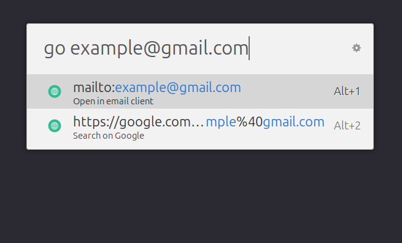
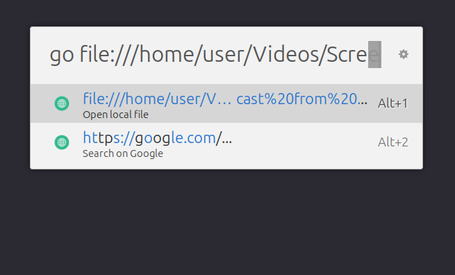
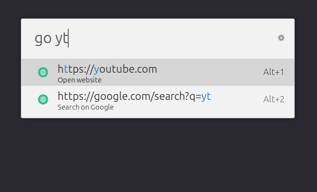
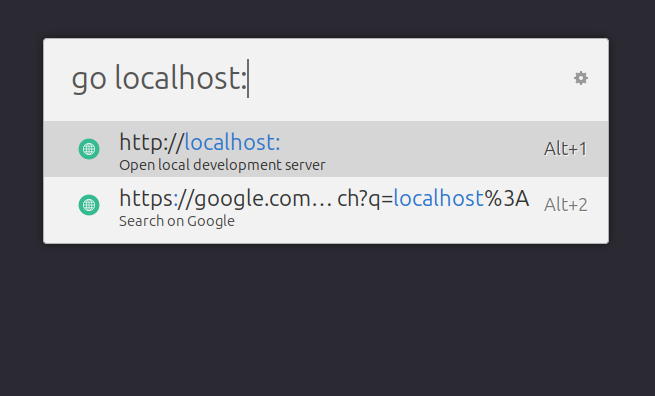
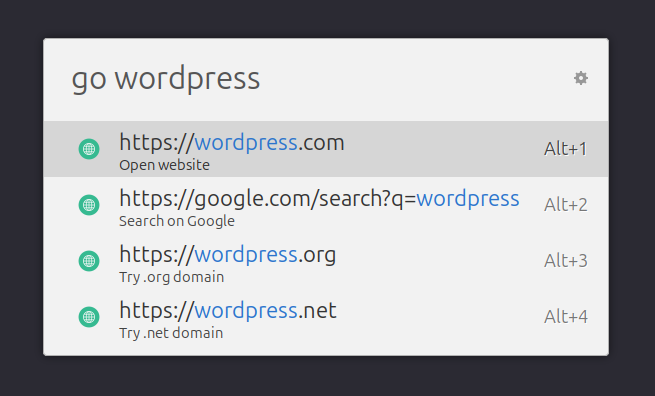

# Smart URL Opener - Ulauncher Extension
An intelligent Ulauncher extension that provides smart URL completion, domain shortcuts, and seamless web browsing with enhanced local development support. 
- Download [ULauncher](https://ulauncher.io/) application (Spotlight Search for Linux)

## Features
### Smart URL Completion
- **Automatic Protocol Detection**: Automatically adds `https://` for domains, `http://` for localhost
- **File Path Support**: Handles local file paths with `file://` protocol
- **IP Address Handling**: Smart detection of IPv4 addresses with appropriate protocol selection
- **Email Detection**: Automatically opens email addresses with `mailto:` protocol

### Domain Shortcuts
Built-in shortcuts for popular websites:
- `gh` → github.com
- `yt` → youtube.com
- `so` → stackoverflow.com
- `fb` → facebook.com
- `ig` → instagram.com
- `wiki` → wikipedia.org
- `docs` → docs.google.com
- `maps` → maps.google.com
- And many more!

### Development-Friendly
- **Localhost Detection**: Automatically uses HTTP for localhost URLs
- **Development Port Recognition**: Recognizes common dev ports (3000, 8000, 8080, etc.)
- **Local Network Support**: Proper handling of local IP ranges (192.168.x.x, 10.x.x.x)

### Intelligent Fallbacks
- **Search Integration**: Falls back to Google search for complex queries
- **Multiple Suggestions**: Provides alternative domain extensions (.com, .org, .net, .io)
- **Error Handling**: Graceful error handling with search fallbacks

## Installation
### Method 1: Manual Installation
1. Clone or download this repository
2. Copy the extension folder to your Ulauncher extensions directory:
```bash
~/.local/share/ulauncher/extensions/
```
3. Restart Ulauncher or go to Preferences → Extensions → Reload Extensions

### Method 2: From Ulauncher Extensions Directory
1. Open Ulauncher Preferences
2. Go to Extensions tab
3. Click "Add Extension"
4. Enter the extension URL from Github or browse for the local folder
```bash
https://github.com/kcoovi/ulauncher-link-opener
```

## Usage
### Basic Usage
1. Open Ulauncher (default: `Ctrl+Space`)
2. Type your keyword (default: `go`) followed by a space
3. Enter your URL, domain, or search term
4. Select from the intelligent suggestions

### Examples
| Input | Result |
|-------|--------|
|`go` | Defaults to https://google.com |
| `go github.com` | Opens https://github.com |
| `go gh` | Opens https://github.com (shortcut) |
| `go localhost:3000` | Opens http://localhost:3000 |
| `go 192.168.1.100` | Opens http://192.168.1.100 |
| `go ~/Documents/file.html` | Opens local file |
| `go user@example.com` | Opens email client |
| `go python tutorial` | Searches Google for "python tutorial" |
| `go reddit` | Opens https://reddit.com |

### Domain Shortcuts
The extension includes shortcuts for popular websites:
```
gh, github     → github.com
yt, youtube    → youtube.com  
so             → stackoverflow.com
reddit         → reddit.com
fb, facebook   → facebook.com
ig, instagram  → instagram.com
wiki, wikipedia → wikipedia.org
docs           → docs.google.com
drive          → drive.google.com
maps           → maps.google.com
translate      → translate.google.com
gmail          → gmail.com
x, twitter     → x.com/twitter.com
linkedin       → linkedin.com
```

## Gallery
<div align="center">
  <table>
    <tr>
      <td></td>
      <td></td>
      <td></td>
    </tr>
    <tr>
      <td align="center"><b>Email Handling</b></td>
      <td align="center"><b>Local File Handling</b></td>
      <td align="center"><b>Domain Shortcut</b></td>
    </tr>
    <tr>
      <td></td>
      <td></td>
      <td></td>
    </tr>
    <tr>
      <td align="center"><b>Smart handling of localhost and development ports</b></td>
      <td align="center"><b>Multiple domain suggestions and intelligent completion</b></td>
      <td></td>
    </tr>
  </table>
</div>

## File Structure
```
smart-url-opener/
├── main.py              
├── manifest.json        
├── README.md           
└── images/
    ├── 1.png
    ├── 2.png
    ├── 3.png
    ├── 4.png
    └── 5.png
```

## Advanced Features
### Smart Protocol Selection
- **HTTPS by default** for public domains
- **HTTP for local development** (localhost, 127.0.0.1, 192.168.x.x, 10.x.x.x)
- **File protocol** for local paths
- **Mailto protocol** for email addresses

### Development Port Detection
The extension recognizes common development ports and automatically uses HTTP:
- 3000, 3001 (React, Node.js)
- 4200 (Angular)
- 5000 (Flask)
- 5173 (Vite)
- 8000, 8080 (Various servers)
- 8888 (Jupyter)
- 9000, 9001 (Various tools)

### Error Handling
- Graceful fallback to Google search for invalid URLs
- Logging for debugging issues
- User-friendly error messages

## Troubleshooting
### Extension Not Loading
1. Check that the extension is in the correct directory
2. Verify all required files are present
3. Check Ulauncher logs: `~/.cache/ulauncher/ulauncher.log`

### URLs Not Opening
1. Verify your default browser is set correctly
2. Check the extension logs for error messages
3. Try opening URLs manually to test browser functionality

## Development
### Requirements
- Python 3.6+
- Ulauncher 5.0+
- Standard Python libraries (no additional dependencies)

### Contributing
1. Fork the repository
2. Create a feature branch
3. Make your changes
4. Test thoroughly
5. Submit a pull request

## License
This project is open source. Feel free to modify and distribute according to your needs.

## Changelog
### Version 2.0.0
- Complete rewrite with improved URL handling
- Added domain shortcuts system  
- Enhanced local development support
- Better error handling and logging
- Removed HTTP fallback option as requested
- Improved alternative suggestions
